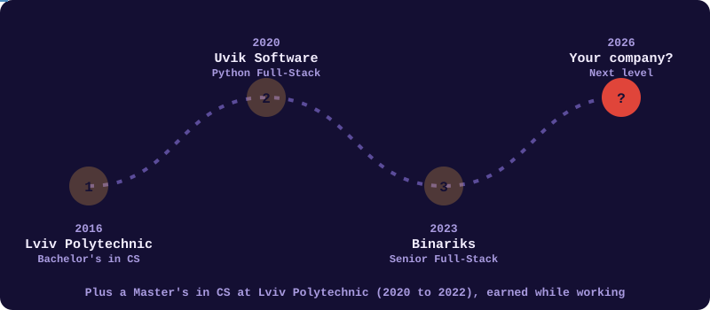

 

### 🗺️ Levels completed

> **Binariks** · Senior Full Stack Developer · 2023–2026
> Built large full-stack apps, sped up slow PostgreSQL endpoints with smart indexing, set up background jobs with Celery and Redis, shipped to AWS with Docker and GitHub Actions.
>
> **Uvik Software** · Python Full-Stack Developer · 2020–2023
> Worked with clients from many industries: Django backends, REST APIs, React and TypeScript interfaces, fast Agile teams.

 

<b>🔍 What's inside this project (click)</b>

 

A cloud platform that helps financial institutions process refunds smarter, based on real-time alerts and automated decisions. I worked on the whole stack: Django backend, React + TypeScript frontend, AWS infrastructure.

On top of that I built two AI helpers:

- **The guide** chats with new customers and explains what the platform does and why it's worth it.
- **The dev helper** writes test cases, reads AWS CloudWatch logs, speeds up bug hunting, and reviews every pull request before merge.

 

